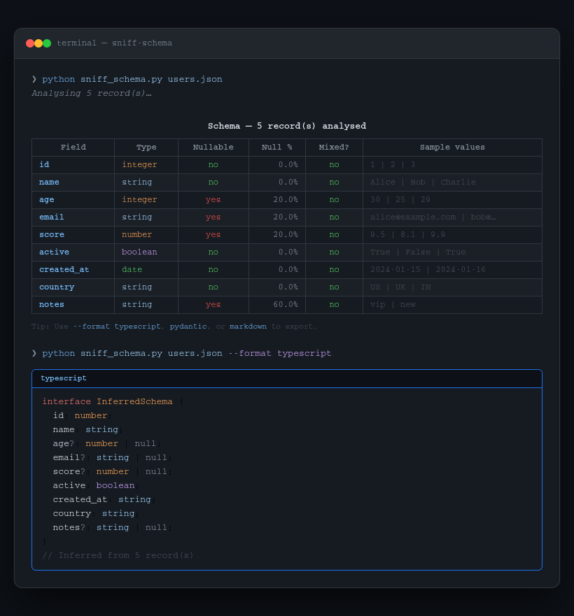

<div align="center">

<h1>sniff-schema</h1>

<p>Infer schema from any JSON or CSV — instantly output as TypeScript, Pydantic, or Markdown.</p>

[](https://pypi.org/project/sniff-schema)
[](https://pypi.org/project/sniff-schema)
[](LICENSE)
[](https://pypi.org/project/sniff-schema)



</div>

---

You get a JSON file or CSV from an API, a colleague, or a legacy system. No docs. No types. Just raw data. `sniff-schema` reads it and tells you exactly what's in it — field names, types, nullability, null percentages, and sample values — then outputs a ready-to-use TypeScript interface or Pydantic model.

No LLM. No cloud. No auth. Pure local analysis.

---

## Install

```bash
pip install sniff-schema
```

Or run directly without installing:

```bash
pip install httpx "rich>=13" "typer>=0.12"
python sniff_schema.py data.json
```

---

## Usage

```bash
# Rich terminal table (default)
sniff-schema data.json

# TypeScript interface
sniff-schema data.json --format typescript

# Pydantic v2 model
sniff-schema data.json --format pydantic

# Markdown table — save to file
sniff-schema data.json --format markdown --output schema.md

# Pipe directly from curl
curl https://api.example.com/users | sniff-schema - --format typescript

# CSV works too
sniff-schema report.csv --format pydantic

# Large files — sample just 100 rows
sniff-schema big_dataset.csv --sample 100
```

---

## What it detects

| Thing | How |
|---|---|
| Integers, floats, booleans, strings | Native Python types |
| ISO 8601 dates / datetimes | Regex match (`2024-01-15`, `2024-01-15T10:30:00Z`) |
| Numeric strings, boolean strings | Pattern matching on string values |
| Nullable fields | Counts `null`, missing keys, and empty strings |
| Mixed types | Flags when a field contains more than one type |
| Nested JSON | Flattens to dot-notation (`user.address.city`) |
| JSON arrays | Handles root arrays, wrapped arrays (`data`, `results`, `items`) |
| NDJSON / JSON Lines | Auto-detected line-by-line |
| CSV dialect | Auto-sniffed (comma, tab, pipe, etc.) |

---

## Output formats

### `--format typescript`
```typescript
interface InferredSchema {
  id: number;
  name: string;
  age?: number | null;
  email?: string | null;
  score?: number | null;
  active: boolean;
  created_at: string;
  country: string;
  notes?: string | null;
}

// Inferred from 5 record(s)
```

### `--format pydantic`
```python
from pydantic import BaseModel
from typing import Optional


class InferredSchema(BaseModel):
    id: int
    name: str
    age: Optional[int] = None
    email: Optional[str] = None
    score: Optional[float] = None
    active: bool
    created_at: str
    country: str
    notes: Optional[str] = None

# Inferred from 5 record(s)
```

### `--format markdown`

Outputs a GitHub-flavored Markdown table — paste directly into your wiki, Notion, or PR description.

---

## All options

```
Arguments:
  SOURCE     Path to JSON/CSV file, or '-' to read from stdin.

Options:
  -f, --format   [table|typescript|pydantic|markdown]  Output format (default: table)
  -s, --sample   Max records to sample (default: 200, max: 100000)
  -o, --output   Write output to a file instead of stdout
  --help         Show this message and exit.
```

---

## Where to install / publish this tool

| Platform | Command | Notes |
|---|---|---|
| **PyPI** | `pip install sniff-schema` | Primary distribution |
| **Homebrew** (tap) | `brew install gitwingo/tap/sniff-schema` | macOS/Linux users who avoid pip |
| **Conda-forge** | `conda install sniff-schema` | Data science audience |
| **GitHub Releases** | Single-file `.py` download | For users who want zero install |
| **pipx** | `pipx install sniff-schema` | Isolated install, great for CLI tools |

> **Recommended publishing order:** PyPI first → GitHub Release (attach `sniff_schema.py`) → Conda-forge (after traction) → Homebrew tap.

---

## Why conda-forge matters for this tool specifically

`sniff-schema` is uniquely well-suited for **conda-forge** because its primary audience — data scientists and ML engineers — overwhelmingly use `conda` environments. Submitting a conda-forge recipe makes it a first-class citizen in that ecosystem. See the [conda-forge contribution docs](https://conda-forge.org/docs/maintainer/adding_pkgs/) to submit a recipe after publishing to PyPI.

---

## Development

```bash
git clone https://github.com/gitwingo/sniff-schema
cd sniff-schema
pip install -e ".[dev]"
```

---

## License

MIT © [gitwingo](https://github.com/gitwingo)
